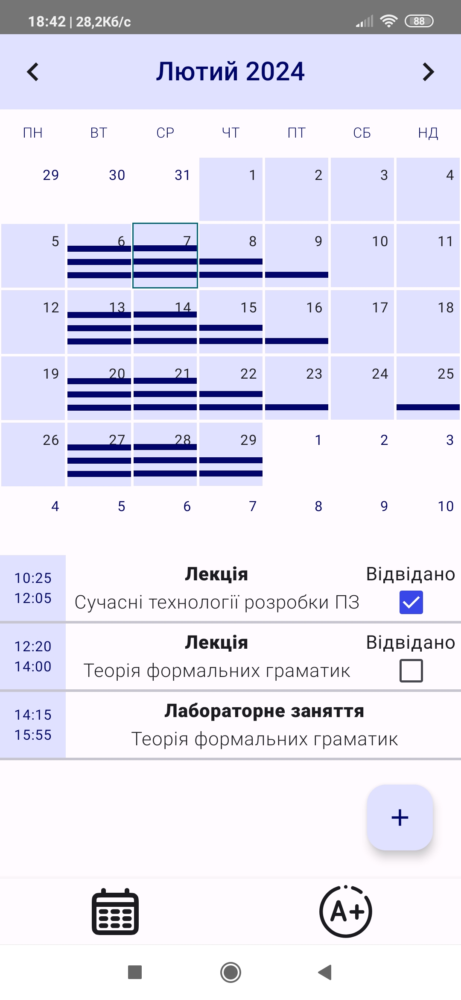
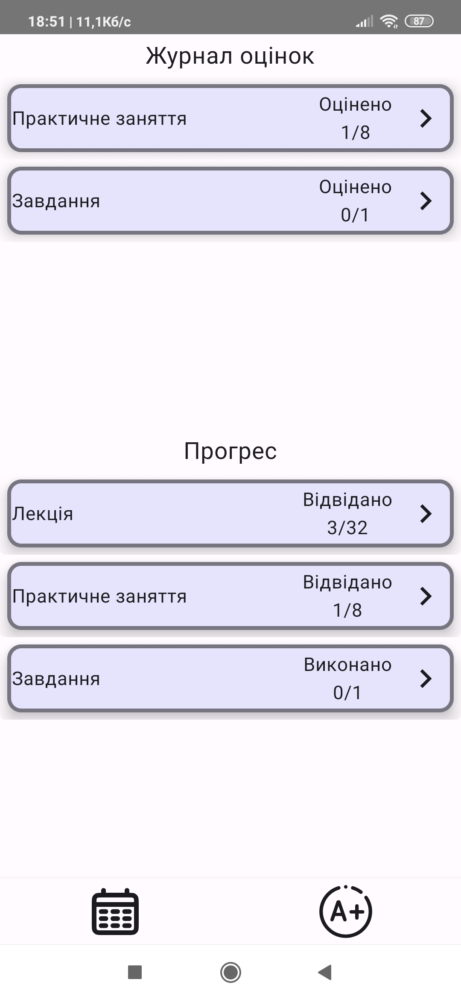
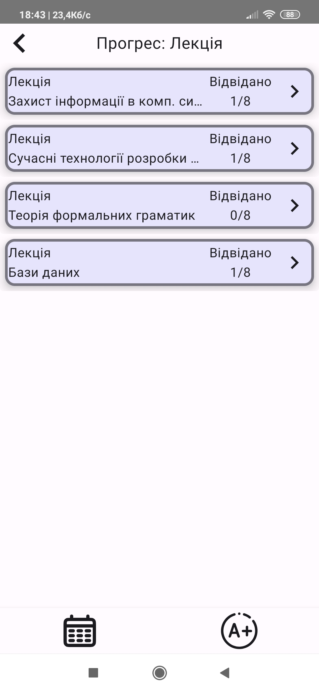
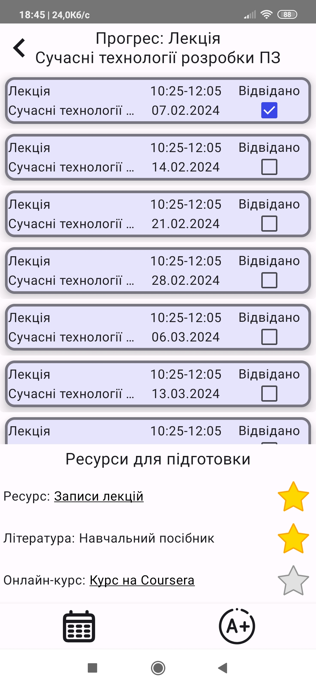
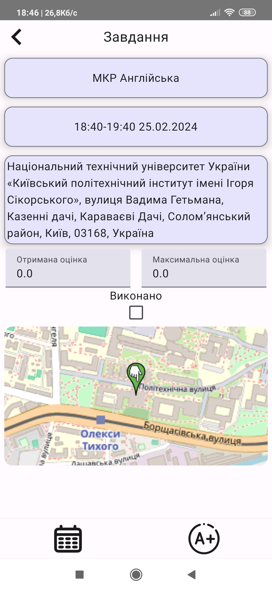

# INT20H-2024: Mobile Development test task
## **PrepPal**, made by "The Null Pointer" team.

## Завдання

Студенти часто стикаються з викликом обліку вивченого матеріалу та підготовки до іспитів. Вашим
завданням буде створити мобільний додаток, який допоможе студентам ефективно керувати своїм
навчальним навантаженням та готуватися до майбутніх іспитів.

## Інструкція з запуску
1. Отримати APK з Firebase App Distribution: https://appdistribution.firebase.dev/i/b3d2d9bd507540dd
2. Встановити APK на телефон з Android OS, мінімальна версія Android - 7.0 (24)

## Скріншоти застосунку

  
Скріншоти

  
  
  
  
  

